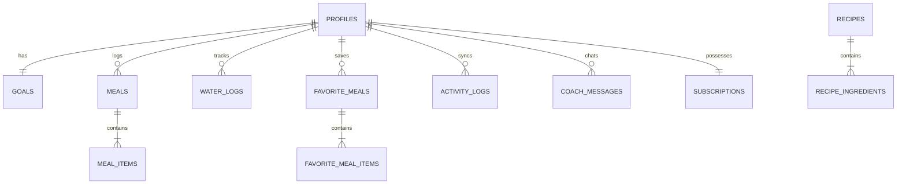

# Nutrición IA Chile — Technical Architecture & Complete Product Specification

> **Document Purpose**: Comprehensive system architecture, engineering decisions, database schemas, and functional flows for AI coders (Codex/Claude/GPT), engineering leads, and technical audits.

---

## 1. Executive Summary & Product Vision

**Nutrición IA Chile** is a production-grade full-stack mobile application engineered to track daily nutrition with minimal user friction through Multimodal AI. Built specifically for the Chilean market, it handles localized dietary habits (e.g., *once*, *marraqueta*, *hallulla*, *cazuela*, *charquicán*, *completo italiano*), Chilean supermarket barcodes (EAN-13 starting with prefix `780`), and local clinical health workflows (nutritionist WhatsApp/CSV summaries and CLP freemium subscriptions).

### Core Principle
> *"Logging food with a photo must be faster, easier, and more reliable than manually typing ingredients."*

---

## 2. Complete Technology Stack

```
┌────────────────────────────────────────────────────────────────────────┐
│                          CLIENT APPLICATION                            │
│  React Native (0.76.6) • Expo SDK 52 • Expo Router v4 (File-based)     │
│  TypeScript 5.3 (Strict) • TanStack Query v5 • Zustand 5 • Zod 3.24   │
└──────────────────────────────────┬─────────────────────────────────────┘
                                   │ HTTPS / WSS
                                   ▼
┌────────────────────────────────────────────────────────────────────────┐
│                           SUPABASE BACKEND                             │
│  PostgreSQL 15 (RLS on 100% tables) • Auth (GoTrue) • Storage (S3 API) │
│  Database Triggers (Auto-totals) • SQL Views • Atomic RPC Functions    │
└──────────────────────────────────┬─────────────────────────────────────┘
                                   │
                                   ▼
┌────────────────────────────────────────────────────────────────────────┐
│                        DENO EDGE FUNCTIONS                             │
│  /analyze-meal      • Gemini 1.5 Flash (Vision) + OpenAI Fallback      │
│  /parse-meal-text   • Multimodal Audio/Text parsing                    │
│  /nutrition-coach   • Live context-injected conversational AI          │
└────────────────────────────────────────────────────────────────────────┘
```

| Layer | Technology | Rationale |
|---|---|---|
| **Mobile Runtime** | React Native 0.76.6 + Expo SDK 52 | Unified iOS, Android, and Web codebase with native performance. |
| **Navigation & Routing** | Expo Router v4 | Deep-linking, file-based routing (`app/`), native modals, and type-safe routes. |
| **Data Fetching & Cache** | TanStack Query v5 (React Query) | Declarative caching, optimistic updates, background refetching, and stale-while-revalidate. |
| **Client State** | Zustand v5 | Lightweight client state for auth session, meal review draft, and offline flags. |
| **Data Validation** | Zod v3.24 | Runtime schema parsing for AI outputs, edge function payloads, and form inputs. |
| **Cloud Database & Auth** | Supabase (PostgreSQL 15 + GoTrue) | Relational integrity, row-level security (RLS), instant Auth, and automated triggers. |
| **Serverless Functions** | Supabase Edge Functions (Deno) | Ultra-low latency edge compute close to Latin America (Santiago / São Paulo). |
| **Primary AI Engine** | Google Gemini 1.5 Flash | High-speed multimodal analysis (<900ms), native audio ingestion, and cost efficiency. |
| **Fallback AI Engine** | OpenAI GPT-4o-mini | Automated failover if Gemini rate limits or errors occur. |
| **Local Security** | Expo SecureStore | Keychain (iOS) & Keystore (Android) encrypted storage for tokens and preferences. |

---

## 3. Database Schema & Relational Architecture (PostgreSQL)

All database operations are enforced with **Row Level Security (RLS)** using `auth.uid() = user_id`.



### 3.1. Tables & Entities
1. **`profiles`**: User bio-parameters (`current_weight_kg`, `height_cm`, `age`, `gender`, `activity_level`, `objective`).
2. **`goals`**: Calorie and macronutrient targets calculated via Mifflin-St Jeor equation.
3. **`meals`**: Logged meals with parent timestamps, photo URLs, and denormalized macro totals (`total_calories`, `total_protein`, `total_carbs`, `total_fat`).
4. **`meal_items`**: Atomic food items detected or edited (`food_name`, `grams`, `calories`, `protein`, `carbs`, `fat`, `source`).
5. **`water_logs`**: Water consumption records (`amount_ml`, `logged_at`).
6. **`barcode_products`**: Product caching for EAN 780 barcodes (`barcode`, `product_name`, `brand`, `calories_100g`, `macros_100g`).
7. **`favorite_meals` & `favorite_meal_items`**: One-tap pre-saved meals allowing $0 AI cost routine logging.
8. **`recipes` & `recipe_ingredients`**: Curated catalog of healthy Chilean traditional dishes with 1-tap logging.
9. **`activity_logs`**: Exercise calories and steps synced dynamically from Apple Health or manual input.
10. **`coach_messages`**: Chat history with real-time snapshot of remaining macros at message time.
11. **`subscriptions`**: RevenueCat subscription state (`free`, `active`, `trialing`) and daily scan quota counters.

### 3.2. Automated Triggers & Views
- **Trigger `recalculate_meal_totals`**: Executes after `INSERT`, `UPDATE`, or `DELETE` on `meal_items`. It automatically recalculates and updates the parent row in `meals` atomically.
- **SQL View `v_daily_totals`**: Aggregates daily energy and macronutrient consumption per user per day for instant rendering on dashboard widgets.
- **RPC Function `check_and_increment_ai_quota`**: Enforces the 3 daily AI scans limit for Free users, automatically resets on midnight calendar changes, and grants unlimited access to Pro users.

---

## 4. End-to-End Functional Flows

### Flow 1: Smart Photo Capture & AI Analysis
```
User captures photo
   │
   ▼
Expo ImageManipulator (Compress to JPEG 1000px, 0.7 quality, Base64)
   │
   ▼
Supabase Edge Function: /analyze-meal (Authenticated)
   │
   ├──► Quota Check (check_and_increment_ai_quota)
   │
   ├──► Provider 1: Gemini 1.5 Flash (Vision System Prompt for Chile)
   │    └── Fallback on failure ──► Provider 2: OpenAI GPT-4o-mini
   │
   ▼
Structured JSON Response (Parsed via Zod: AIStructuredOutputSchema)
   │
   ▼
Review Screen (`app/meal/review.tsx`):
   • Incremental adjustments: [-10g] [+10g] with live macro recalculation
   • Chilean Variant Modal: Change Marraqueta ⟷ Hallulla ⟷ Pan de Molde
   │
   ▼
Atomic DB Insert into `meals` + `meal_items` (Trigger updates totals)
   │
   ▼
Dashboard React Query invalidation (Instant UI update)
```

### Flow 2: Multimodal Text & Direct Audio Dictation
- User speaks into microphone: *"Me comí dos huevos revueltos con media marraqueta y una taza de café sin azúcar"*.
- Audio encoded to Base64 is sent directly to Gemini 1.5 Flash via `inline_data` (bypassing Whisper to eliminate double API latency, executing in <900ms at ~$0.0001 USD).
- Extracted items and grams are populated into `useMealReviewStore` for instant user confirmation.

### Flow 3: EAN-13 / EAN 780 Chilean Barcode Scanner
- Camera scans barcode using `expo-camera`.
- `barcodeService.ts` checks Supabase `barcode_products`.
- If missing, queries Open Food Facts API (with specific headers for Chilean products).
- Automatically saves new items to the community database for subsequent users.

### Flow 4: Conversational AI Nutrition Coach
- Endpoint: `/nutrition-coach`.
- Context injection: Edge function queries the user's active goals, consumed meals today, remaining grams of protein, carbs, fats, and hydration level before calling Gemini.
- The model adopts the persona of a warm, science-grounded Chilean clinical nutritionist, recommending practical Chilean foods (jurel San José, atún al agua, marraqueta con quesillo Colun, porotos con riendas desgrasados).

### Flow 5: Nutritionist Clinical Report Export
- User selects range (7 days or 30 days).
- Service computes real daily averages: kcal/day, Protein g/day, Carbs g/day, Fat g/day, Water ml/day, and adherence rates.
- **Output A (WhatsApp/Email)**: Formatted Markdown text with medical structure and emojis ready to share via native share sheet.
- **Output B (Excel/CSV)**: RFC 4180-compliant CSV spreadsheet with escaped meal items.

### Flow 6: RevenueCat Paywall & Freemium Monetization
- **Free Tier**: Unlimited manual text and barcode scanning, capped at **3 AI photo scans per day**.
- **Pro Tier**: Unlimited AI scans, unlimited voice dictation, 24/7 AI coach, and clinical nutritionist report exports.
- **Chilean Peso Pricing**:
  - Monthly: **$4.990 CLP / month**.
  - Annual: **$39.990 CLP / year** ($3.332 CLP/month, 33% savings, 7-day free trial).

### Flow 7: Local Notification Reminders & Offline Resilience
- Pre-scheduled Chilean meal hours: Breakfast (08:30), Lunch (13:30), Once/Dinner (20:30), and Hydration (16:00).
- Network checking hook (`offlineService.ts`) detects signal loss and displays `<OfflineBanner />` on the dashboard, retaining cached data through TanStack Query.

---

## 5. Directory Structure & Key Files

```
/Users/alvaro/nutricionapp/
├── app/                                 # Expo Router v4 routes
│   ├── _layout.tsx                      # Root navigation, Auth guards & QueryClient
│   ├── (auth)/                          # Authentication flows
│   │   ├── login.tsx                    # Email & Password sign-in
│   │   ├── register.tsx                 # Account creation
│   │   └── forgot-password.tsx          # Password recovery
│   ├── (onboarding)/                    # Mifflin-St Jeor Setup
│   │   ├── profile-setup.tsx            # Weight, height, age, gender, activity
│   │   └── goals-review.tsx             # Interactive target calories & macro sliders
│   ├── (tabs)/                          # Main Bottom Tabs
│   │   ├── _layout.tsx                  # Tab bar configuration
│   │   ├── index.tsx                    # Daily Dashboard (CalorieHero, Macros, Water, Meals)
│   │   ├── history.tsx                  # Calendar history & Weekly macro chart
│   │   └── settings.tsx                 # Profile, Pro status, Reminders, Export
│   ├── meal/                            # Meal capture modal flows
│   │   ├── camera.tsx                   # Image picker, camera capture & AI trigger
│   │   ├── review.tsx                   # Interactive [-10g][+10g] and Chilean variant screen
│   │   └── barcode.tsx                  # EAN 780 Barcode scanner
│   ├── coach/index.tsx                  # AI Nutrition Coach chat
│   ├── recipes/                         # Healthy Chilean recipes
│   │   ├── index.tsx                    # Recipe catalog with category filters
│   │   └── [id].tsx                     # Recipe detail with 1-tap meal import
│   ├── paywall/index.tsx                # RevenueCat Pro subscription modal in CLP
│   └── export/index.tsx                 # Clinical report generator (WhatsApp / CSV)
│
├── src/
│   ├── components/
│   │   ├── common/OfflineBanner.tsx     # Offline warning banner
│   │   ├── dashboard/                   # CalorieHero, MacroProgressBar, MealCard, WaterCard
│   │   ├── meal/                        # VariantModal, TextVoiceModal, FavoritesModal
│   │   └── charts/WeeklyMacroChart.tsx  # 7-day average visualization
│   ├── constants/colors.ts              # Semantic theme tokens (Emerald/Slate palette)
│   ├── hooks/                           # Custom React Query & Store hooks
│   │   ├── useAuth.ts                   # Supabase authentication hook
│   │   ├── useDailyNutrition.ts         # Day query & cache invalidation
│   │   ├── useMealAnalysis.ts           # Vision AI pipeline hook
│   │   ├── useCoachChat.ts              # Real-time chat hook
│   │   └── useSubscription.ts           # Quota checking & RevenueCat purchase hook
│   ├── services/                        # API & DB Service abstractions
│   │   ├── supabase.ts                  # Supabase client singleton
│   │   ├── mealService.ts               # Meals CRUD operations
│   │   ├── barcodeService.ts            # EAN 780 resolver
│   │   ├── subscriptionService.ts       # RPC quota & tier manager
│   │   ├── nutritionistReportService.ts # Clinical CSV & text builder
│   │   └── notificationService.ts       # Chilean meal hours scheduler
│   ├── stores/                          # Zustand stores
│   │   ├── useAuthStore.ts              # Session & profile state
│   │   └── useMealReviewStore.ts        # In-flight meal items being edited
│   ├── types/                           # Zod schemas & TypeScript types
│   │   ├── database.types.ts            # Generated Supabase DB types
│   │   ├── meal.ts                      # Meal & AI schemas
│   │   └── profile.ts                   # Profile & onboarding schemas
│   └── utils/
│       ├── nutritionCalculator.ts       # Mifflin-St Jeor formula implementation
│       └── __tests__/                   # Jest automated test suites
│
├── supabase/
│   ├── migrations/                      # 4 Sequential PostgreSQL migrations
│   └── functions/                       # Deno Edge Functions
│       ├── analyze-meal/                # Multimodal food recognition
│       ├── parse-meal-text/             # Multimodal text & audio parsing
│       └── nutrition-coach/             # Context-injected nutrition chat
```

---

## 6. Verification & Automated Test Results

The codebase is verified with **100% TypeScript type safety** and **16 automated Jest unit tests**:

```bash
# 1. TypeScript Strict Verification
$ npx tsc --noEmit
Exit Code: 0 (Zero errors)

# 2. Automated Test Suite
$ npx jest
PASS src/utils/__tests__/nutritionistReport.test.ts
PASS src/types/__tests__/parseMealText.test.ts
PASS src/utils/__tests__/activityAndRecipes.test.ts
PASS src/utils/__tests__/nutritionCalculator.test.ts
PASS src/types/__tests__/mealSchema.test.ts

Test Suites: 5 passed, 5 total
Tests:       16 passed, 16 total
Snapshots:   0 total
Time:        0.261 s
```

---

## 7. How to Run Locally

### Prerequisites
- Node.js >= 18
- Expo CLI (`npx expo`)

### Commands
```bash
# Install dependencies
npm install

# Start development server
npm run dev

# Press 'w' for Web, or scan QR code with Expo Go on iOS / Android
```

---
*Generated for architectural handoff and Codex pairing.*
