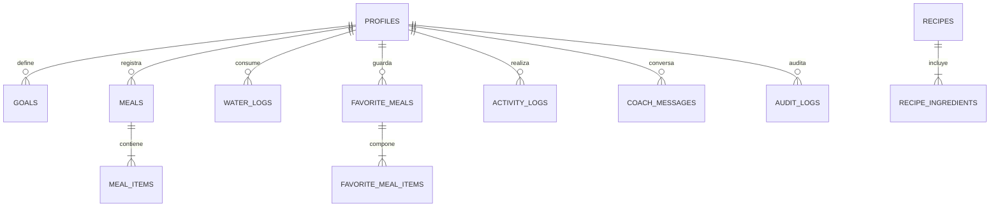

# Arquitectura de Base de Datos: Módulos, Esquemas y Triggers (PostgreSQL & Supabase)

Este documento detalla la estructura modular, paquetes de dominio, disparadores automáticos (triggers) y políticas de seguridad que rigen la base de datos de **Nutrición IA**.

---

## 1. Esquemas Modulares (Namespaces)

La base de datos utiliza una separación en esquemas para garantizar máxima seguridad y aislamiento:

```
┌────────────────────────────────────────────────────────┐
│                   SUPABASE POSTGRESQL                  │
├─────────────────────────┬──────────────────────────────┤
│  Esquema `public`       │  Esquema `app_private`       │
│  (Expuesto a la App)    │  (Oculto / Alta Seguridad)   │
├─────────────────────────┼──────────────────────────────┤
│  • profiles             │  • audit_logs                │
│  • goals                │  • cleanup_old_meal_photos() │
│  • meals                │  • logs de mantenimiento     │
│  • meal_items           │                              │
│  • barcode_products     │                              │
│  • favorite_meals       │                              │
│  • water_logs           │                              │
│  • activity_logs        │                              │
│  • recipes              │                              │
│  • coach_messages       │                              │
│  • subscriptions        │                              │
└─────────────────────────┴──────────────────────────────┘
```

1. **`public`**:
   - Contiene los modelos accesibles por la aplicación móvil y web.
   - Protegido al 100% mediante **Row Level Security (RLS)** (`auth.uid() = user_id`).
2. **`app_private`**:
   - Totalmente invisible para la API de PostgREST.
   - Almacena eventos de auditoría (`audit_logs`) y rutinas de mantenimiento sin exponerse al cliente.
3. **`storage`**:
   - Gestiona el bucket privado `meal_photos` con políticas de lectura/escritura/borrado por usuario.

---

## 2. Paquetes y Dominios Funcionales

Las tablas y funciones se organizan en 4 paquetes lógicos:

### Paquete 1: Identidad, Metas y Onboarding
* **`profiles`**: Datos biométricos del usuario (peso actual, estatura, edad, género, nivel de actividad y objetivo).
* **`goals`**: Metas calóricas diarias y distribución de macronutrientes (proteína, carbohidratos, grasas).
* **`personal_plans`**: Plan maestro personalizado con ciclado de carbohidratos (días de entrenamiento vs. descanso).

### Paquete 2: Diario Nutricional y Alimentos
* **`meals`**: Registro de comidas (Desayuno, Almuerzo, Once/Cena, Colación) con sus totales desnormalizados.
* **`meal_items`**: Alimentos atómicos que componen cada comida (nombre, gramos, calorías, macros, nivel de confianza de la IA).
* **`barcode_products`**: Base de datos de códigos de barra (EAN 780 chilenos y productos precargados).
* **`favorite_meals` & `favorite_meal_items`**: Comidas frecuentes pre-guardadas para registro en 1 segundo con costo $0 de IA.

### Paquete 3: Hábitos y Recetas Tradicionales
* **`water_logs`**: Consumo de agua por toma (ml) y vista agregada diaria `v_daily_water_totals`.
* **`activity_logs`**: Registro de pasos y calorías quemadas por ejercicio físico.
* **`recipes` & `recipe_ingredients`**: Catálogo de recetas chilenas saludables (Cazuela, Charquicán, etc.) con sus ingredientes vinculados.

### Paquete 4: Inteligencia Artificial y Coach
* **`coach_messages`**: Historial de conversación con el Coach IA con snapshot del estado nutricional al momento de la consulta.
* **`ai_request_limits`**: Cuotas y control de peticiones para evitar abusos o costos inesperados.
* **`subscriptions`**: Estado de suscripción y límites de escaneo por usuario.

---

## 3. Catálogo de Triggers (Disparadores Automáticos)

Los triggers automatizan la lógica de negocio directamente dentro del motor de PostgreSQL en tiempo real:

```mermaid
flowchart TD
    A[Usuario agrega / edita / elimina alimento en meal_items] -->|AFTER INSERT/UPDATE/DELETE| B(Trigger: trg_recalculate_meal_totals)
    B -->|Suma calorías, P, C, G atómicamente| C[Actualiza fila padre en meals]
    
    D[Usuario actualiza peso u objetivo en profiles] -->|AFTER UPDATE| E(Trigger: trg_log_profile_changes)
    E -->|Guarda registro histórico| F[Inserta en app_private.audit_logs]

    G[Cualquier fila se modifica] -->|BEFORE UPDATE| H(Trigger: trg_touch_updated_at)
    H -->|Establece updated_at = now()| I[Garantiza timestamp real]
```

### Detalle de los Triggers Implementados:

1. **`trg_recalculate_meal_totals`**:
   - **Tabla**: `public.meal_items`
   - **Evento**: `AFTER INSERT OR UPDATE OR DELETE`
   - **Efecto**: Suma instantáneamente todas las calorías y macronutrientes de los ingredientes y actualiza el encabezado en `public.meals`. La app nunca tiene que hacer sumatorias manuales.

2. **`trg_log_profile_changes`**:
   - **Tabla**: `public.profiles`
   - **Evento**: `AFTER UPDATE`
   - **Efecto**: Si el usuario cambia su peso o su objetivo, guarda un snapshot en `app_private.audit_logs` con el valor anterior y el nuevo valor, permitiendo graficar la evolución de peso a largo plazo.

3. **`trg_touch_updated_at`**:
   - **Tablas**: `profiles`, `goals`, `meals`, `favorite_meals`, `subscriptions`
   - **Evento**: `BEFORE UPDATE`
   - **Efecto**: Actualiza automáticamente el campo `updated_at` al reloj del servidor (`now()`), evitando fechas manipuladas desde el cliente.

4. **`app_private.cleanup_old_meal_photos(days_threshold)`**:
   - **Esquema**: `app_private`
   - **Efecto**: Elimina de Supabase Storage las fotos que superen el umbral configurado (14 días), manteniendo el almacenamiento liviano y dentro de la capa gratuita, y registra la acción en `audit_logs`.

---

## 4. Diagrama Entidad-Relación Completo


